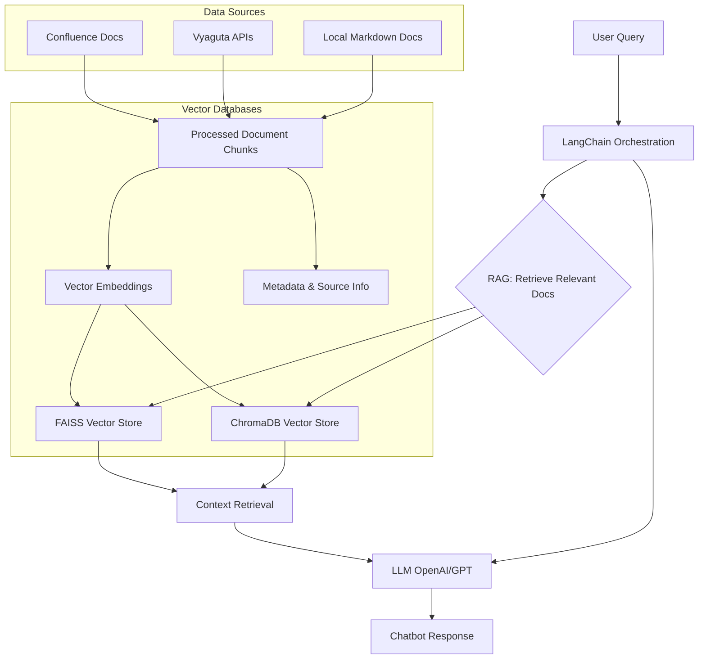

# Vyaguta AI

<!-- Vyaguta AI Assistant is an intelligent chatbot designed to help Leapfroggers quickly find information about Vyaguta’s modules, onboarding, policies, tools, and more. It leverages Retrieval-Augmented Generation (RAG), LangChain, and OpenAI’s LLMs to provide instant, context-aware answers from company documentation/APIs and knowledge bases. -->

<!--  -->

https://github.com/user-attachments/assets/9a9d62f5-5db4-4251-8311-b5207060842d

---

<details>
<summary>UI Feature Gallery & Page Previews</summary>


</details>

## What is Vyaguta AI Assistant?

Vyaguta AI Assistant is your smart companion for all things Vyaguta and Leapfrog. It can:

- Answer questions about Vyaguta modules (Core, OKR, Pulse, Attendance, Teams, Jump, Honor, Auth etc.)
- Guide you through onboarding, policies, and company processes
- Help you find team contacts, resources, and tools
- Explain coding guidelines and best practices
- Provide instant, reliable answers from internal docs, FAQs and APIs

## How does it work? (Workflow Overview)

Vyaguta AI Assistant follows a Retrieval-Augmented Generation (RAG) workflow, combining company knowledge with advanced language models to deliver accurate# , context-aware answers. Here’s how the system works:

<details>
<summary>1. Data Sources</summary>
<br/>

- **Local Documents:** Markdown files in the `docs/` directory (policies, onboarding, guidelines, etc.)
- **Vyaguta API:** Live employee and people data fetched from Vyaguta’s internal API
- **Confluence:** Company wiki pages (integration available, see guides)

</details>

<details>
<summary>2. Document Processing & Embeddings</summary>
<br/>

- Documents are loaded and split into chunks using markdown header-based splitting for fine-grained retrieval
- Each chunk is embedded using OpenAI Embeddings (Ada-002)
- All embeddings are stored in a FAISS vector database/ chromaDB for fast similarity search

</details>

<details>
<summary>3. Retrieval-Augmented Generation (RAG)</summary>
<br/>

- When a user asks a question, the system retrieves the most relevant document chunks using semantic search
- A hybrid retriever with contextual compression ensures only the most relevant information is passed to the LLM

</details>

<details>
<summary>4. Large Language Model (LLM)</summary>
<br/>

- The retrieved context is sent to an OpenAI LLM (e.g., GPT-4.1-nano)
- A custom prompt template ensures answers are tailored to Vyaguta and Leapfrog

</details>

<details>
<summary>5. Answer Delivery</summary>
<br/>

- The LLM generates a helpful, context-aware answer
- The answer is displayed in a modern chat UI (Streamlit), with features like quick questions, reactions, and chat export

</details>

#### Visual Workflow



For a detailed technical breakdown and architecture, see `/guides/workflow-explanation.md`.

## Tech Stack

- **LLMs:** OpenAI’s GPT models for natural language understanding and generation
- **RAG:** Retrieval-Augmented Generation for context-aware answers
- **LangChain:** For managing the workflow and integrating components
- **OpenAI:** For semantic search and document retrieval
- **Data Storage:** ChromaDB vector database for fast similarity search
- **Frontend Options:**
  - **Streamlit** - Quick prototyping with `chatbot_gui.py`
  - **React + TypeScript + Tailwind** - Production-ready custom UI in `client/`
- **Backend:**
  - **FastAPI** - REST API server in `server/`
  - **LangChain** - For RAG orchestration

---

<details>
<summary><strong>Project Structure Overview</strong></summary>

## Project Structure

```
vyaguta-ai/
├── client/                  # React + TypeScript + Tailwind frontend
│   ├── src/
│   │   ├── components/      # UI components
│   │   ├── services/        # API services
│   │   ├── types/           # TypeScript types
│   │   └── App.tsx          # Main application
│   ├── package.json
│   └── vite.config.ts
├── server/                  # FastAPI backend
│   ├── api.py               # REST API endpoints
│   └── run.py               # Server runner
├── docs/                    # Documentation files
├── docs-api/                # API documentation
├── docs-confluence/         # Confluence documentation
├── chroma_db/               # Vector database
├── chatbot_gui.py           # Streamlit UI (legacy)
├── main.py                  # Core RAG logic
├── rag_pipeline.py          # RAG pipeline setup
├── config.py                # Configuration
└── requirements.txt         # Python dependencies
```

</details>

---

<details>
<summary><strong>Set Up & Usage</strong></summary>

## Set Up & Usage

### Option 1: React + FastAPI (Recommended)

**1. Install Python dependencies:**

```bash
pip install -r requirements.txt
```

**2. Start the FastAPI backend:**

```bash
python -m server.run
# Or: cd server && python run.py
```

The API will be available at `http://localhost:8000`

**3. Install and start the React frontend:**

```bash
cd client
pnpm install
pnpm run dev
```

The UI will be available at `http://localhost:5173`

### Option 2: Streamlit UI (Legacy)

```bash
pip install -r requirements.txt
streamlit run chatbot_gui.py
```

> **Note:** This project uses pnpm as the package manager for the frontend.

---

## API Endpoints

| Endpoint               | Method | Description                      |
| ---------------------- | ------ | -------------------------------- |
| `/api/health`          | GET    | Health check                     |
| `/api/chat`            | POST   | Send message and get AI response |
| `/api/quick-questions` | GET    | Get predefined quick questions   |
| `/api/surprise`        | GET    | Get a random surprise question   |

### Example: Send a message

```bash
curl -X POST http://localhost:8000/api/chat \
  -H "Content-Type: application/json" \
  -d '{"message": "What is Vyaguta?"}'
```

</details>

---

<details>
<summary><strong>Environment Variables</strong></summary>

Create a `.env` file in the root directory:

```env
# Confluence API credentials
CONFLUENCE_BASE_URL=your_confluence_base_url_here
CONFLUENCE_EMAIL=your_confluence_email_here
CONFLUENCE_API_TOKEN=your_confluence_api_token_here
CONFLUENCE_SPACE_KEYS=space_key1,space_key2

# Vyaguta API credentials
# VYAGUTA_ACCESS_TOKEN=your_vyaguta_access_token_here
VYAGUTA_REFRESH_TOKEN=your_vyaguta_refresh_token_here

# OPENAI API key
OPENAI_API_KEY=your_openai_api_key_here

# Vyaguta
# VYAGUTA_BASE_URL=`https://example.com`
VYAGUTA_CLIENT_ID=your_vyaguta_client_id_here

# --- Environment Configuration ---
# Set the environment for logging and debug control.
# Options:
#   local      - For local development (minimal debug output)
#   test       - For running tests (shows all debug logs)
#   production - For production deployment (no debug logs)
ENV=local

# --- LangSmith Configuration ---
# Get your API key from https://smith.langchain.com/
# Create a new project for your RAG pipeline monitoring
LANGCHAIN_TRACING_V2=true
LANGCHAIN_API_KEY=your_langchain_api_key_here
LANGCHAIN_PROJECT=your_langchain_project_name_here
```

</details>

---

For setup, usage, and advanced guides, see the `/guides/` folder in this repository.
